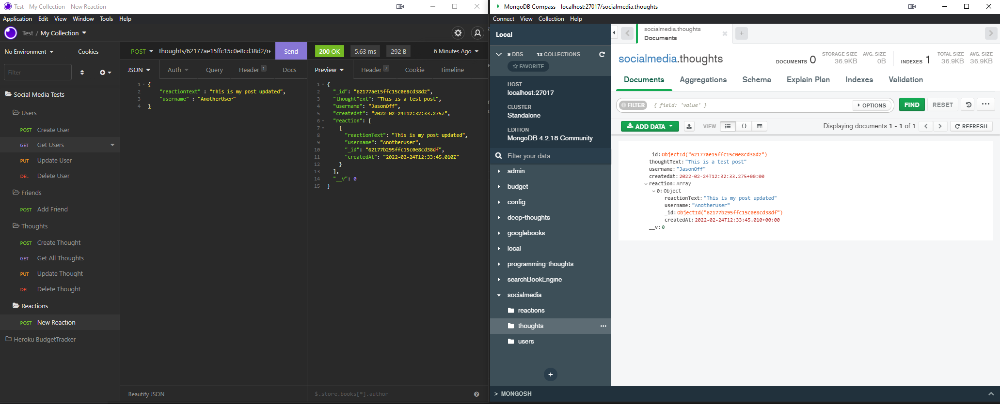

    

# SocialMediaAPI

## Table of Contents
* [Description](#Description)
* [Usage](#Usage)
* [Installation](#Installation)
* [Deployed](#Deployed)

## Description
This is an API route application written to be used as a base for a social media platform.

## Usage
Open up a program like Insomnia to test the routes as shown in the video below.

[Video Link of usage](https://drive.google.com/file/d/1jYMW2eykBv-WRccCMEB0tCoSb-I0hoGw/view?usp=sharing)
## Installation
Clone this repo and run "npm i" on the application. after that run "npm start"

## Deployed
There is no current deployed application for this repo
